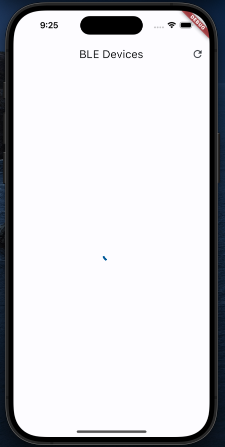
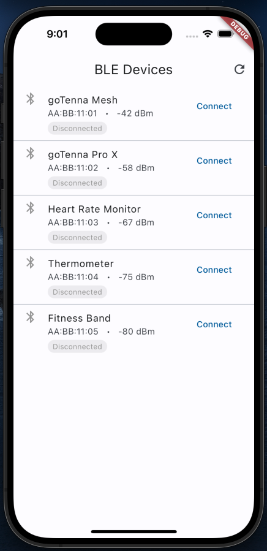
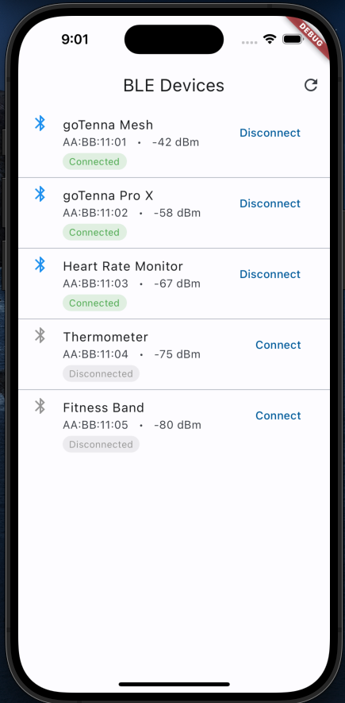
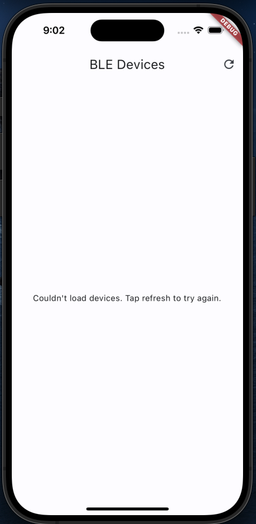
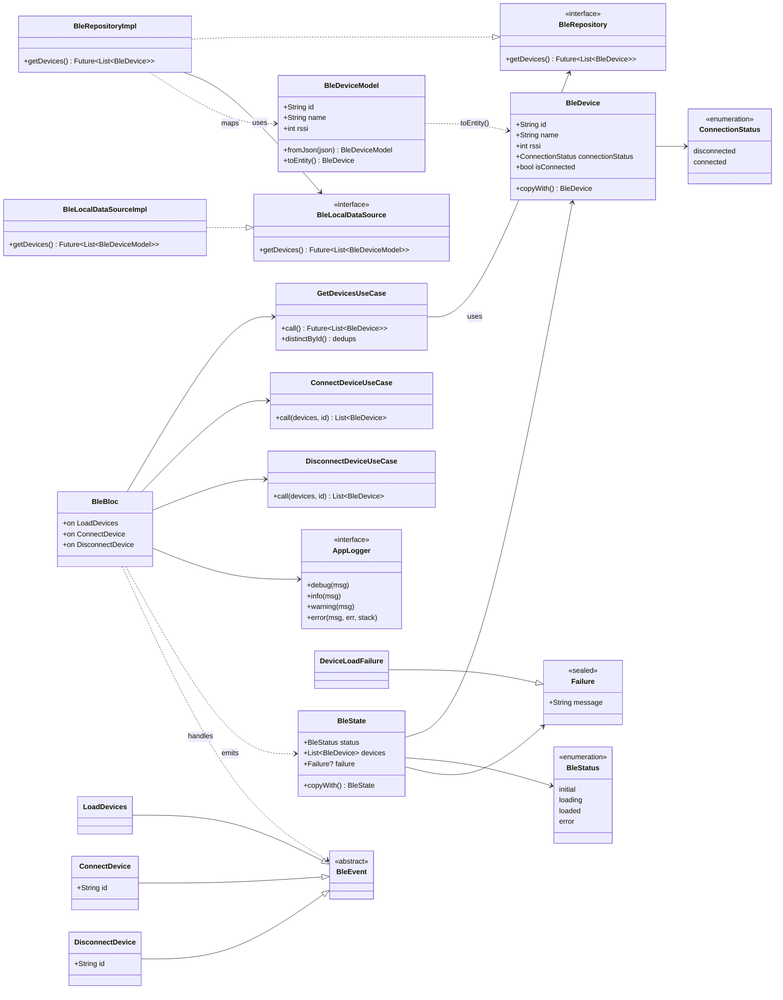

# device_app

A small Flutter app that lists BLE devices and lets you connect or disconnect
from each one. The brief was to parse the device data from JSON and simulate the
connections rather than talk to a real BLE device, so that's what it does. The
Bluetooth is mocked, and the focus is on how the app is put together.

## Screenshots

| Loading | Devices found | Connected | Error |
|---|---|---|---|
|  |  |  |  |

The list loads asynchronously with a short simulated delay, so you get a real
loading spinner on launch instead of the data just popping in. The delay is
injectable and defaults to zero in tests, so it doesn't slow anything down. Swap
the bundled asset for an actual BLE scan later and the loading handling is
already there.

## Running it

```
flutter pub get
flutter run
```

`flutter test` runs the tests, `flutter analyze` runs the analyzer.


## How it's laid out

```
lib/
├── main.dart                         # Entry point; hand-wired DI + global error handlers
├── core/                             # Cross-cutting concerns, feature-agnostic
│   ├── error/
│   │   └── failure.dart              # Failure type carrying a UI-friendly message
│   ├── logging/
│   │   ├── app_logger.dart           # AppLogger interface (no package dependency)
│   │   └── dev_logger.dart           # Impl wrapping dart:developer
│   └── observer/
│       └── app_bloc_observer.dart    # Central logging of bloc state changes + errors
└── features/
    └── ble/                          # The BLE feature, split by layer
        ├── domain/                   # Business rules — plain Dart, no Flutter
        │   ├── models/
        │   │   └── ble_device.dart       # BleDevice entity
        │   ├── repositories/
        │   │   └── ble_repository.dart    # Repository interface (the boundary)
        │   └── usecases/
        │       ├── get_devices.dart       # Loads + dedupes by id
        │       ├── connect_device.dart
        │       └── disconnect_device.dart
        ├── data/                     # Where data comes from
        │   ├── datasources/
        │   │   └── ble_local_data_source.dart  # Reads bundled JSON asset
        │   ├── models/
        │   │   └── ble_device_model.dart       # JSON <-> domain mapping
        │   └── repositories/
        │       └── ble_repository_impl.dart    # Implements the domain interface
        └── presentation/             # BLoC + widgets
            ├── bloc/
            │   ├── ble_bloc.dart
            │   ├── ble_event.dart
            │   └── ble_state.dart          # Single state, status enum
            ├── screens/
            │   └── device_list_screen.dart
            └── widgets/
                └── device_tile.dart

assets/
└── devices.json                      # Mocked device data (stands in for a scan)

test/                                 # Mirrors lib/ — coverage at every layer
├── core/observer/
└── features/ble/{domain,data,presentation,helpers}/
```

Clean architecture, organized by feature. Everything BLE-related lives under
`lib/features/ble`, split into three layers:

- **domain**: the business rules, plain Dart with no Flutter imports. The
  `BleDevice` entity, the `BleRepository` interface, and the use cases.
- **data**: where the data actually comes from. Reads a bundled JSON file and
  maps it into domain objects.
- **presentation**: the BLoC and the widgets.

The rule I stuck to is that dependencies point inward. The domain has no idea
JSON exists, and the UI has no idea where devices come from. It only talks to
the repository interface. Cross-cutting stuff (logging) sits in `lib/core`.

State is handled with flutter_bloc. There's a single `BleState` with a status
enum (initial / loading / loaded / error), and the screen just draws whatever
the current state happens to be.

## Class diagram

The core types and how they depend on each other. Note the direction of the
arrows: presentation depends on domain, data implements domain, and the domain
depends on nothing outward.



## What's real and what isn't

Mocked:

- Device data is a JSON file (`assets/devices.json`), not an actual scan.
- Connect/disconnect just flips a flag on the device in memory. Nothing touches
  the Bluetooth stack.

I faked those on purpose so the structure could be the focus. The trade-off is
that the genuinely hard parts of BLE aren't here. A real version would need
runtime permissions (the Android 12 Bluetooth permissions plus location on older
versions are their own thing), a real scan stream, a proper connection state
machine (connecting, timed out, reconnecting, not just on/off), plus GATT,
retries, and handling for Bluetooth being turned off or denied.

The upside of the layering is that most of that is a data-layer swap. The use
cases, the bloc, and the widgets wouldn't change much, because they only depend
on the `BleRepository` interface.

That mocking is also why the bloc's handlers aren't symmetrical.
`_onLoadDevices` is `async` and wrapped in try/catch, because it awaits the data
source and asset loading or JSON parsing can genuinely fail. `_onConnectDevice`
and `_onDisconnectDevice` are neither: connect/disconnect is a pure in-memory
list transformation that returns synchronously and can't throw, so `async` would
await nothing and a try/catch would guard nothing. With a real BLE stack those
two become async, fallible I/O (timeout, out of range, Bluetooth off), and
they'd grow the same `async` + try/catch treatment, mapping errors to `Failure`
cases. The asymmetry is deliberate, not an oversight.

One detail worth calling out: the JSON has duplicate device ids in it. Deduping
is a business rule, so it happens in the domain (`GetDevicesUseCase`), keeping
the first of each id. The data source hands back whatever is in the file.

## Errors and logging

Errors are handled in one place: the bloc. If a load fails, it logs the
technical cause once and emits a `Failure` carrying a friendly message for the
UI. The user never sees a raw exception.

Logging goes through a small `AppLogger` interface so nothing depends on a
specific logging package; the real implementation just wraps `dart:developer`.
A `BlocObserver` logs state changes and errors centrally, and there are a couple
of global handlers in `main` for anything that slips through. I kept it light on
purpose. I didn't want logging just for the sake of it.

## Tests

`flutter test` runs everything. There's coverage at each layer: the dedup
logic, the JSON parsing (including a check against the real asset so a broken
file gets caught), the bloc, and widget tests for the screen and the device row.
Test doubles are hand-written fakes plus mocktail for the bloc.

## Left out on purpose

Given the scope:

- No real BLE (see above).
- Dependency wiring is done by hand in `main.dart` instead of a DI package.
  Fine for a single screen.
- No CI set up, though `flutter analyze` and `flutter test` both pass.
